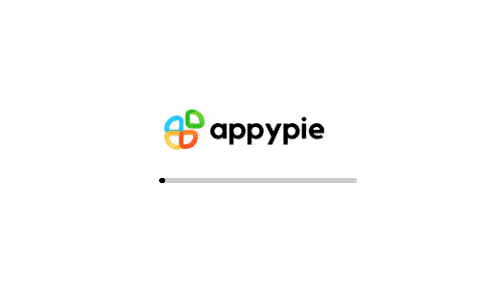

# 🎨 Appy Pie Canva Replicate

A web-based image editing tool inspired by Canva. This application allows users to upload images, adjust them within a stencil frame!

---

## ✨ Features

- 📸 **Image upload and manipulation**
- 🖼️ **Stencil-based design with adjustable frames**
- 🔍 **Zoom and positioning controls**
- ↩️ **Undo/Redo functionality**
- 📱 **Responsive design for all devices**

---

## 🛠️ Technologies Used

- ⚛️ **React.js** – for UI components  
- 🔄 **Redux** – for state management  
- 🎨 **Fabric.js** – for canvas manipulation  
- 🎨 **CSS** – for styling and layout

---

## 🚀 Getting Started

### ✅ Prerequisites

- Node.js (v14.0.0 or higher)  
- npm (v6.0.0 or higher)

### 📦 Installation

Clone the repository:

```bash
git clone https://github.com/your-username/appy-pie-canva-replicate.git
cd canva-stencil-editor
```

Install dependencies:

```bash
npm install
```

Start the development server:

```bash
npm start
```

Open your browser and navigate to:  
```bash
http://localhost:3000
```
---

## 📖 Usage

### 🔼 Upload an Image
Click **Upload Image** to select an image from your device.

### 🛠️ Adjust the Image
- Resize the canvas using the top-right size inputs.
- Use `+` / `-` zoom buttons to resize the image.
- Click and drag to move the image within the stencil.
- Hold **Shift** and use zoom controls to resize the stencil frame.

### ↩️ Undo / Redo Changes
Use **Undo** and **Redo** buttons to navigate your edit history.

### 🔁 Reset
Click the **Reset** button to return to the initial state.

### ✏️ Stencil Manipulation
- Hold **Shift** to select and move the stencil frame.
- Release **Shift** to return to image mode.

---

## 📁 Project Structure

```
src/
├── components/
│   ├── Canvas/           # Canvas rendering and interaction
│   ├── Controls/         # Zoom and editing controls
│   ├── DebugPanel/       # Development debugging tools
│   ├── ImageUpload/      # Image upload functionality
│   ├── StencilEditor/    # Main editor component
│   └── WelcomeAnimation/ # Welcome screen animation
├── redux/                # Redux state management
├── utils/                # Utility functions for Fabric.js
├── App.js                # Main application component
└── index.js              # Application entry point
```

---

## 🧰 Tools Used

- 🖱️ **Cursor** – for an AI-assisted coding environment  
- 💬 **Stack Overflow** – for community wisdom and quick bug fixes  
- 🧠 **ChatGPT** – for explanations, code suggestions, and guidance  
- 🤖 **Claude AI** – for brainstorming and co-piloting development ideas  
